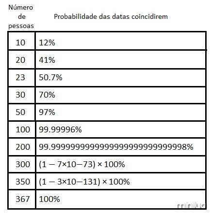
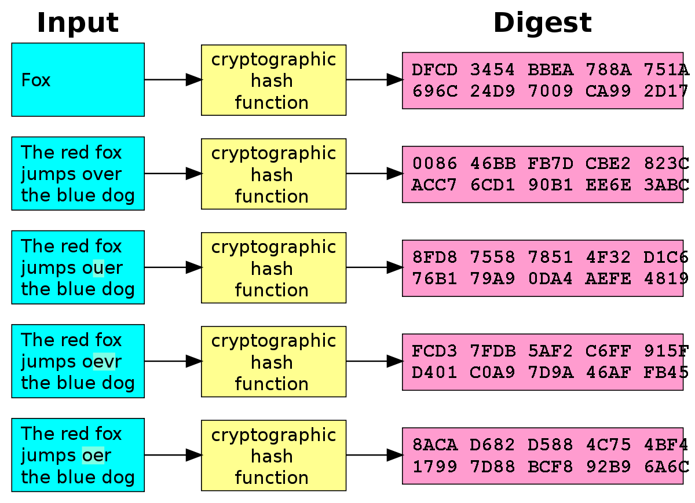
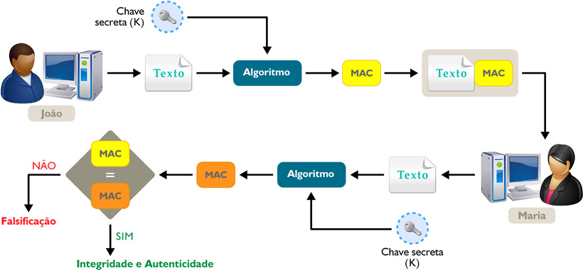
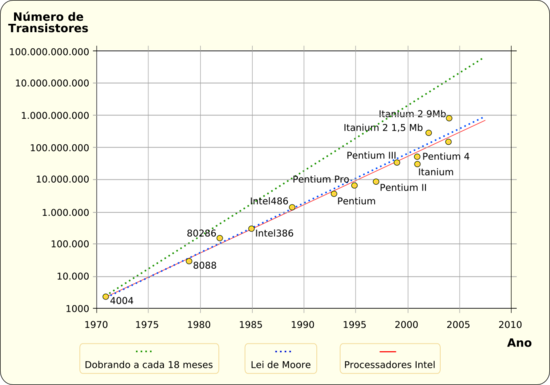
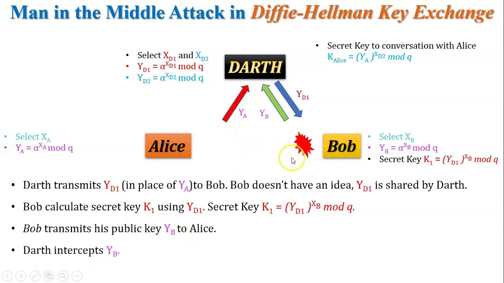
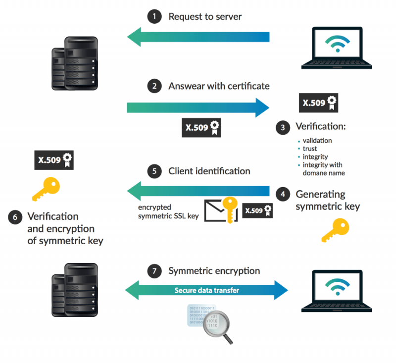

## Segurança e Criptografia no Desenvolvimento de Software


Baseado nos videos de criptografia do Fabio Akita:

- [Video 1](https://www.youtube.com/watch?v=CcU5Kc_FN_4&ab_channel=FabioAkita)
- [Video 2](https://www.youtube.com/watch?v=HCHqtpipwu4&ab_channel=FabioAkita)

<br/>

Muitos desenvolvedores negligenciam a importância da segurança em seus códigos. Há 20 anos, era comum ver programadores concatenando manualmente comandos SQL com inputs dos usuários, um erro que poderia levar a vulnerabilidades graves, como SQL Injection. Felizmente, frameworks modernos como Rails, Django, Laravel e ASP.NET fornecem ORMs (Object-Relational Mapping) que ajudam a sanar essas falhas, evitando grande parte dos ataques.

Esses frameworks também fornecem proteção contra outros ataques, como:
- `CSRF (Cross-Site Request Forgery)`:
    * CSRF utiliza links ou scripts para enviar solicitações de HTTP involuntárias para um site de destino onde o usuário está autenticado.
- `Session Hijacking`:
    * Também conhecido como sequestro de cookies, os atacantes conseguem utilizar de um cookie ativo para utilizar sessões abertas e obter informações da vítima.
- `Replay Attacks` 
    * E um ataque no qual uma entidade maliciosa intercepta e repete uma transmissão de dados válida que trafega por uma rede. Devido à validade dos dados originais (que normalmente vêm de um usuário autorizado), os protocolos de segurança da rede tratam o ataque como se fosse uma transmissão de dados normal. 
- `SQL Injection` 
    * Quando o atacante utiliza no input comandos SQL, caso o desenvolvedor na comunicação com o banco de dados não tenha feito um tratamento adequado, o atacante pode fazer alterações no banco de dados.

Contudo, em busca de performance, alguns desenvolvedores optam por não utilizar ORMs ou mesmo abandonar os recursos de segurança oferecidos pelos frameworks, arriscando comprometer a segurança dos usuários e dos dados armazenados.

A criptografia desempenha um papel essencial na proteção de dados, especialmente quando consideramos armazenamento de senhas. Muitos sistemas, nos primeiros dias da web, armazenavam senhas em texto puro. Hoje, essa prática é considerada perigosa, já que uma invasão do banco de dados poderia expor facilmente todas as senhas dos usuários. Uma solução frequentemente proposta é a encriptação simétrica das senhas, onde a informação é codificada e pode ser decodificada utilizando uma chave secreta. Contudo, esse método ainda tem vulnerabilidades, visto que se a chave secreta for exposta, as senhas podem ser desencriptadas.

* No caso de salvar as senhas tem textos, o sistema possui um ponto crítico de falha, pois se o invasor tiver acesso ao banco de dados ele vai possuir todas as senhas dos usuários, senhas essas que eles podem utilizar em outros sites.

* Já no segundo caso, com as senhas criptografadas, o atacante precisa de tanto do acesso ao banco de dados e a chave secreta para se apossar da senha dos usuários.

#### Exemplo em Python: Criptografia Simétrica usando a biblioteca Fernet
```python
from cryptography.fernet import Fernet

# Gerando uma chave secreta
chave = Fernet.generate_key()
cipher = Fernet(chave)

# Encriptando uma mensagem
texto = "senha_secreta"
texto_encriptado = cipher.encrypt(texto.encode())
print(f"Texto Encriptado: {texto_encriptado}")

# Desencriptando a mensagem
texto_original = cipher.decrypt(texto_encriptado).decode()
print(f"Texto Desencriptado: {texto_original}")
```

Neste exemplo, estamos usando o Fernet, um esquema de encriptação simétrica, para encriptar e depois desencriptar uma senha. Se a chave for mantida em segredo, o sistema é seguro. Mas se a chave for exposta, qualquer pessoa poderá desencriptar os dados.

Em conclusão, segurança e criptografia são aspectos cruciais no desenvolvimento de software. Enquanto frameworks e boas práticas avançam, é imperativo que os desenvolvedores se eduquem constantemente para garantir a proteção dos dados e dos usuários.

### Hash:

Estas funções recebem uma entrada e produzem uma saída de tamanho fixo, independentemente do tamanho da entrada.
Ao contrário da encriptação, as funções de hash são de direção única e são irreversíveis.
Exemplos incluem `MD5`, `SHA1`, `SHA2` e `SHA3`.
Diferenças entre Funções de Hash e Encriptação:

Enquanto a encriptação permite a reversão do processo (decriptação), as funções de hash não.
Algoritmos de hashing comuns, como MD5 e SHA1, foram considerados inseguros devido a vulnerabilidades. O MD5 por exemplo é ótimo para ser usado em verificação da integridade de arquivos, porém não é bom para criar criar hash de senhas, pois é computacionalemnte rápido facilitando o ataque de força bruta.

Mas existe um problema, o Hash MD5 para a palavra “secreto” é e sempre será `88dabf3d5306998c155971257440f3be`, ou seja, um ataque de força bruta (onde testamos diversas palavras e calculamos seu MD5) encontraria palavras curtas e que existem no dicionário rapidamente.

Isso é mais grave ainda em sistemas que permitem apenas senhas numéricas, muitos usuários utilizam datas de aniversário, de nascimento dos filhos ou de casamento, se considerarmos todas as datas de 1900 até 2100, temos apenas 73048 dias, em um sistema que pede 8 dígitos onde o usuário tinha 100 milhões de combinações possíveis, testar apenas 0,073% das combinações deve quebrar perto de 99% das senhas.

Por isso pedimos aos usuários que adicionem símbolos, números e variem entre maiúsculas e minúsculas, para aumentar a complexidade do ataque.

Os ataques de força bruta podem ser otimizados para ataques de dicionário, podemos, por exemplo, deixar calculado o Hash de todas as palavras em inglês e português, nomes de pessoas, animais de estimação, cidades e datas com 6 e 8 dígitos, em formato americano e internacional.


Um ótimo exemplo disto é o trabalho https://natmchugh.blogspot.com/2015/02/create-your-own-md5-collisions.html, no qual o autor fez pequenas modificações nos bytes das imagens, alterando 1 bit por pixel (uma variação sutil na cor que é quase indetectável ao olho humano) para que ambas as imagens apresentassem o mesmo valor MD5.


#### Processo de Hashing:

A entrada é dividida em blocos e processada para produzir uma saída de tamanho fixo.
Operações matemáticas são aplicadas a cada bloco, com resultados anteriores influenciando o processamento de blocos subsequentes.
Problemas Comuns:

- `Ataques de Colisão`: Ocorrem quando duas entradas diferentes produzem o mesmo hash. Isso compromete a integridade da função.
    * `Paradoxo do aníversário`: Se 23 pessoas forem escolhidas aleatoriamente, a chance de pelo menos duas delas terem a mesma data de aniversário é maior do que 50. Isso nós alerta da probabilidade de diferentes senhas compatilharem hash iguais, assim é possivel acessar uma conta usando uma senha diferente mais que gere o mesmo hash.

        

```python
import hashlib

# Exemplo simplificado para ilustrar colisão
hash1 = hashlib.md5("texto1".encode()).hexdigest()
hash2 = hashlib.md5("texto2".encode()).hexdigest()

if hash1 == hash2:
    print("Colisão encontrada!")
```

- `Ataques de Extensão de Comprimento`: Explorem a maneira como os algoritmos de hash processam blocos de entrada.
- Quando o atacante modifica o arquivo de forma calculada produzindo o mesmo hash de saida.
Ataques de Extensão de Comprimento: Um atacante pode adicionar dados adicionais à entrada e calcular um novo hash sem conhecer a entrada original.

Suponha que temos um algoritmo de hash muito básico para strings chamado simpleHash que retorna a soma dos valores ASCII de cada caractere da string, módulo 1000. Ou seja, ele converte cada letra em seu valor ASCII, soma esses valores e, em seguida, toma o módulo 1000 do resultado.

Vamos calcular o hash para duas strings diferentes: "ACE" e "BDF":

```scss
simpleHash("ACE") = (65 + 67 + 69) % 1000
                  = 201 % 1000
                  = 201

simpleHash("BDF") = (66 + 68 + 70) % 1000
                  = 204 % 1000
                  = 204
```
Neste caso, as duas strings têm valores de hash diferentes. No entanto, vamos considerar as strings "AB" e "BA":

```scss
simpleHash("AB") = (65 + 66) % 1000
                 = 131 % 1000
                 = 131

simpleHash("BA") = (66 + 65) % 1000
                 = 131 % 1000
                 = 131
```

#### Usos de Funções de Hash:

- Verificar a integridade dos dados transmitidos.
    * Ex: Se um contrato passado para o email não foi interceptado e alterado, com o hash é possível verificar a integridade.
* Criar uma impressão digital única para a entrada.
Conclusão:

Enquanto as funções de hash são poderosas e têm uma variedade de usos, é crucial usar algoritmos de hashing seguros e atualizados para garantir a integridade e segurança dos dados.

Exemplo de um código sem uso de libs: 
* https://github.com/Utkarsh87/md5-hashing/blob/master/md5.py


### Impressão Digital (ou Digest): 
Converte entradas em uma representação única e menor. Ideal para verificação rápida de duplicatas ou para armazenar senhas de forma segura.


Message Authentication Code (MAC) com SHA1:


Para criar um MAC, o servidor concatena um segredo ao nome do arquivo, ajusta seu tamanho (padding) para ser divisível por 160 bits, e então aplica o SHA1 sucessivamente.
Sem conhecer o segredo, mas sabendo seu tamanho, um atacante pode manipular a entrada, adicionando novos blocos, e gerar um MAC válido. Isso é possível porque as informações necessárias para processar novos blocos estão contidas no hash anterior.
Riscos de Uso Público de Algoritmos:

Se o software é de código aberto (ex: WordPress, Magento), um atacante pode identificar o tamanho do segredo usado na função hash verificando o código-fonte. Saber o tamanho do segredo é fundamental para o ataque de extensão de comprimento.
HMAC - Hash-Based Message Authentication Code:

Para evitar os ataques mencionados, o HMAC foi introduzido. Em vez de apenas hashear a mensagem e o segredo, o HMAC aplica a função de hash duas vezes, incorporando o segredo em ambas as operações. Isso fortalece a verificação e autenticação.
SHA3, um algoritmo mais recente, naturalmente tem características de HMAC, tornando-o mais seguro contra esses ataques.
Hashes e Senhas:

Hashing de senhas é uma prática comum para armazenamento seguro. No entanto, muitos usuários têm senhas fracas, facilitando ataques de dicionário.
Tais ataques utilizam tabelas pré-computadas de hashes para comparar rapidamente e identificar senhas. Além disso, apesar de colisões (dois inputs diferentes produzindo o mesmo hash) serem raras, elas são matematicamente possíveis.
Paradoxo do Aniversário:

O paradoxo explica que a probabilidade de duas pessoas em uma sala de 30 terem o mesmo aniversário é de cerca de 70%. Isso ilustra como colisões em funções hash podem ser mais comuns do que se espera.
UUID e GUID:

Se precisa de identificadores únicos, deve-se usar UUID ou GUID, e não hashes como SHA256. Ambos UUID e GUID são identificadores de 128 bits, mas são projetados para minimizar a chance de colisão.
Exemplo em Python: Demonstração de como um HMAC pode ser gerado.

```python
import hmac
import hashlib

def gerar_hmac(secret, message):
    return hmac.new(secret.encode(), message.encode(), digestmod=hashlib.sha256).hexdigest()

# Exemplo de uso:
secret = "meusegredo"
message = "nomedoarquivo"
print(gerar_hmac(secret, message))
```

### Sobre Força Bruta
Um ataque de força bruta é a tentativa de descobrir o segredo criptográfico utilizando um computador para calcular todas as possibilidades. Porém esse método está diretamente relacionado a potencia atual dos nosso harwares e em que nível de grandeza estão as áreas de buscas.

A capacidade de um processador ou de um sistema para calcular hashes é geralmente medida em "hashes por segundo" (H/s). Isso indica quantos cálculos de hash a máquina ou o sistema pode realizar em um único segundo. Para o campo de mineração de criptomoedas, essas taxas são cruciais, pois determinam a eficiência de um minerador em competir por recompensas de bloco.

Para se ter noção hoje o processador <a href="https://www.viperatech.com/product/bitcoin-miner-s19-xp-hyd/">Antminer S19XP Hydro</a> usado para mineração de bitcoin tem uma taxa de resolução de hash de 257TH/s ou seja 257 trilhões de hashes por segundo. A titulo de comparação o processador Intel top de linha `Blockscale ASIC` consegue atingir uma taxa de 580 GH/s ou seja bilhões de hashes por segundo.

Essa informação é importante, pois muitos dos algorítimos sendo utilizados hoje é na intenção de dificultar e tornar inviável computacionalmente ou financeiramente(custos em manter o funcionamento desses hardawares) os ataques de força bruta.

Um motivo para querer que um algorítimo de Hash seja computacionalmente mais pesado, afim de dificultar a utilização de força bruta.

Outra estratégia para dificultar o ataque de força bruta e a utilização de algorítimos criptográficos no qual consomem muita memória. A memória é um recurso mais caro atualmente e de uma evolução menos íngrime do que a dos processadores, a evolução dos hardwares deve levar mais tempo até tornar as demandas de memória por esses algorítimos obsoletas.



#### Alguns desses algorítimos com maior consumo de memória são:
* bcrypt
* Script
* Argon2 


`Observações:`
* Base64 = Binário para texto. Não use para encriptar algo pois é facilmente convertido. O mesmo vale para ASCII armor e Radix64, então não os use para tal.

### SWAP file
Outro aspecto de segurança importante para se conhecer é o SWAP File. E uma extensão da memória RAM física. Ele é um espaço em um disco rígido ou SSD no qual é usado para armazenar partes de programas e dados que não cabem na RAM ou que não estão sendo usados ativamente pelo sistema no momento.

Como o arquivo SWAP pode conter partes da memória que foram transferidas para o disco, um invasor que ganhe acesso ao sistema e ao arquivo SWAP pode potencialmente recuperar informações sensíveis, como senhas, chaves de criptografia ou outros dados privados.

A intel por exemplo possui o <a href="https://www.intel.com/content/www/us/en/architecture-and-technology/software-guard-extensions.html">SGX</a> (SAFE GUARD EXTENSIONS), no qual isola aplicações que contenham dados sensíveis, em uma região privada da memória chamadas enclaves, tornando o acesso a essas informações difíceis a potenciais invasores.

### Encriptação simétrica de chaves

A encriptação simétrica de chaves é uma forma de criptografia onde uma única chave é usada tanto para encriptar (codificar) quanto para desencriptar (decodificar) a informação. Essa abordagem é chamada "simétrica" precisamente porque a mesma chave é empregada em ambos os processos (encriptação e desencriptação).

#### Principais características da encriptação simétrica:

Velocidade: A encriptação simétrica geralmente é mais rápida do que a encriptação assimétrica, tornando-a mais adequada para encriptar grandes volumes de dados.

Segurança da Chave: Como a mesma chave é usada para encriptar e desencriptar, é crucial mantê-la em segredo. Se alguém obtém a chave, essa pessoa pode tanto encriptar quanto desencriptar as mensagens.

Distribuição de Chave: Um dos principais desafios da encriptação simétrica é a distribuição segura da chave entre as partes. Como ambas as partes precisam da mesma chave, é necessário um método seguro para compartilhá-la sem comprometer a segurança.

Usos Comuns: A encriptação simétrica é frequentemente usada em conjunto com a encriptação assimétrica para obter os benefícios de ambas. Por exemplo, a encriptação simétrica pode ser usada para encriptar a mensagem em si, enquanto a encriptação assimétrica pode ser usada para encriptar a chave simétrica que será compartilhada entre as partes.

#### Alguns algoritmos populares de encriptação simétrica incluem:

* `AES` (Advanced Encryption Standard): Atualmente, é o algoritmo padrão recomendado para uso pelo governo dos EUA e é amplamente adotado em todo o mundo.

* `DES` (Data Encryption Standard): Um dos primeiros padrões amplamente adotados, mas que agora é considerado inseguro devido à sua chave relativamente curta e vulnerabilidades descobertas.

* `3DES` (Triple DES): Uma variação do DES que aplica o algoritmo DES três vezes para aumentar a segurança.

Ao usar a encriptação simétrica, é essencial garantir que a chave permaneça secreta e protegida, pois qualquer pessoa com acesso a ela pode desencriptar os dados codificados com essa chave.

### Encriptação Assimétrica

A encriptação assimétrica, também conhecida como criptografia de chave pública, diferente da criptação simétrica, é uma técnica que utiliza dois tipos de chaves: uma chave pública e uma chave privada. Estas chaves são matematicamente relacionadas, mas, na prática, é computacionalmente inviável derivar a chave privada a partir da chave pública.

Para a utilização desse tipo de encriptação a primeira parte é a troca das chaves públicas e privadas. Mas como fazer isso de uma maneira segura? Uma das primeiras soluções é o algoritmo <a href="https://pt.wikipedia.org/wiki/Troca_de_chaves_de_Diffie%E2%80%93Hellman">Diffie-Hellman</a>. O protocolo se baseia em propriedades matemáticas de logaritmos discretos em um campo finito. Especificamente, ele explora o fato que, enquanto é relativamente fácil computacionalmente calcular potências modulares (exponenciação modular), é difícil fazer o oposto (logaritmo discreto) em um tempo razoável.

O protocolo Diffie-Hellman é vulnerável ao ataque de Man-in-the-Middle (MitM). Aqui está uma descrição simplificada de como esse ataque funciona:


Para combater vulnerabilidades como o ataque de MitM no Diffie-Hellman, o protocolo Station-to-Station (`STS`) foi proposto. O STS combina Diffie-Hellman com assinaturas digitais para fornecer autenticação mutuamente autenticada, garantindo que as partes sejam genuínas.

Durante o handshake, além de trocar as partes públicas como no Diffie-Hellman tradicional, as partes também trocam assinaturas digitais destas partes públicas. Cada parte pode então verificar a assinatura da outra parte usando a chave pública conhecida da outra parte. Se a assinatura for verificada corretamente, cada parte pode ter certeza de que a parte pública que recebeu é genuína e não foi interceptada ou alterada por um atacante.

Agora com uma maneira de se transmitir as chaves públicas de uma maneira mais segura, precisamos de um algorítimo de criptografia. E uma das principais opções é o <a href="https://www.techtarget.com/searchsecurity/definition/RSA#:~:text=RSA%20is%20a%20type%20of,is%20used%20to%20decrypt%20it.">RSA</a>, cujo nome deriva dos sobrenomes dos seus inventores (Ron Rivest, Adi Shamir e Leonard Adleman), é um dos algorítmos de criptografia de chave pública mais populares e influentes. Foi introduzido em 1977 e revolucionou o campo da criptografia, permitindo tanto a cifragem como a assinatura digital usando um esquema de chave pública. 

- `Fundamento Matemático`: O RSA baseia-se na dificuldade de fatorar grandes números compostos. Se um número é produto de dois números primos de tamanho semelhante (e ambos os primos são desconhecidos), atualmente não existe nenhum algoritmo eficiente conhecido que possa fatorar esse número em um tempo razoável.

- `Assinatura Digital`: O RSA também pode ser usado para assinatura digital. A parte que assina a mensagem cria um "resumo" da mensagem usando uma função de hash e depois cifra esse resumo usando sua chave privada. O receptor, ao receber a mensagem e a assinatura, pode decifrar a assinatura com a chave pública do remetente e comparar o resultado com o resumo da mensagem, confirmando assim a autenticidade e integridade da mensagem.


### AC's
AC, a abreviação de Autoridade de Certificação (em inglês, Certificate Authority ou CA), refere-se a uma entidade responsável por emitir certificados digitais. Esses certificados são usados na internet e em outras redes para confirmar a autenticidade de uma entidade e garantir a integridade e confidencialidade das informações transmitidas.

O principal papel de uma AC é atestar a identidade de entidades. Quando um servidor (como um website) apresenta um certificado emitido por uma AC confiável, ele está basicamente dizendo: "Você pode confiar em mim; esta AC respeitável verificou quem eu sou"

Certificados digitais são uma parte fundamental de protocolos como SSL/TLS, que protegem as comunicações na web. Sem ACs para emitir e gerenciar esses certificados, não seria possível verificar a autenticidade dos sites ou estabelecer conexões seguras.


### TLS/SSL

As famosas siglas TLS/SSL que frequentemente usamos sem entender o que quer dizer, agora podem fazer mais sentido com os conceitos que foram trazidos aqui.

O TLS (Transport Layer Security) e seu predecessor, SSL (Secure Sockets Layer), são protocolos criptográficos projetados para fornecer comunicações seguras pela internet. Eles são frequentemente usados para proteger dados transmitidos entre navegadores web e servidores, como informações de cartão de crédito em transações online, mas são aplicáveis a outras comunicações também.




### Agora um resumo de algumas das principais técnicas utilizadas na área de criptografia e segurança.

#### Criptografia Simétrica:
- `AES` (Advanced Encryption Standard): Talvez o mais amplamente reconhecido e utilizado algoritmo de criptografia simétrica. É utilizado em várias aplicações, desde VPNs a sistemas de pagamento.

- `Blowfish e Twofish`: Algorítmos de criptografia simétrica desenvolvidos como alternativas ao DES. Twofish foi um dos finalistas no processo de seleção do AES.

#### Criptografia Assimétrica:

- `RSA` (Rivest–Shamir–Adleman): Um dos algoritmos de chave pública mais amplamente utilizados. É usado tanto para cifragem quanto para assinatura digital.
- `DSA` (Digital Signature Algorithm): Usado principalmente para assinaturas digitais.
- `ECC` (Elliptic Curve Cryptography): Baseado nas propriedades matemáticas das curvas elípticas e pode oferecer segurança comparável com chaves mais curtas em relação ao RSA e ao DSA.
- `Diffie-Hellman`: Utilizado para troca segura de chaves, permitindo que duas partes estabeleçam uma chave secreta compartilhada.

#### Funções Hash Criptográficas:
- `SHA-2`: Uma família de funções hash que inclui SHA-224, SHA-256, SHA-384, SHA-512, SHA-512/224 e SHA-512/256. Atualmente, é seguro e amplamente utilizado.
- `SHA-3`: Publicado em 2015, é a mais recente família de funções hash padrão aprovado pelo NIST e serve como uma alternativa ao SHA-2.

#### Protocolos de Segurança:
- `SSL/TLS`: Utilizados para proteger comunicações na web e em muitos outros protocolos. O SSL foi o precursor do TLS.
- `PGP` (Pretty Good Privacy) e `GPG` (GNU Privacy Guard): Usados para cifrar e assinar e-mails e outros dados.
